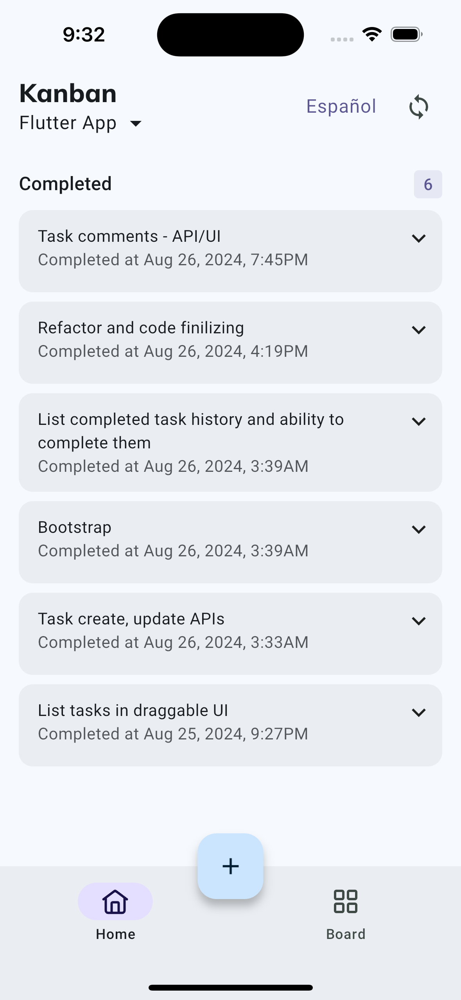
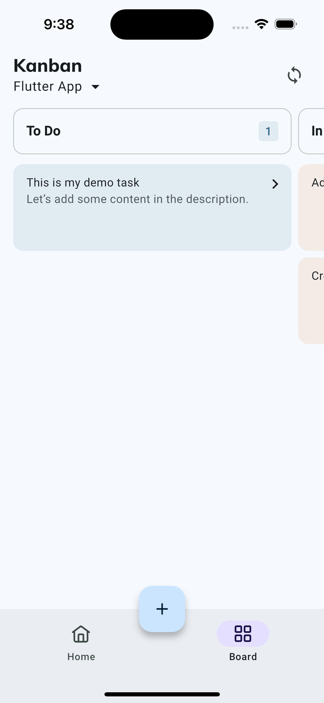
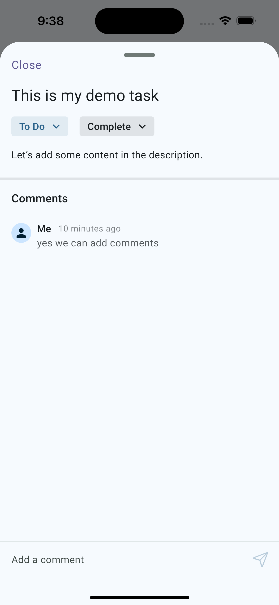

# Kanban

Flutter app for Kanban board to manage tasks using Todoist API.

## Features
- [x] View all projects and select one to view tasks
- [x] View all tasks and their details
- [x] Add new or edit the task
- [x] Move task between sections
- [x] Add or view task comments
- [x] Complete task
- [x] View completed task history
- [x] Reopen completed task

## Screenshots
| Home | Board | Task |
| --- | --- | --- |
|  |  |  |

## Screen records
| Create | Edit | Complete |
| --- | --- | --- |
| [Create](.content/create.mp4) | [Edit](.content/edit.mp4) | [Complete](.content/complete.mp4) |

## Pre-requisites
Make sure you have following or latest flutter/dart sdk installed on your machine. If not, follow the instructions [here](https://flutter.dev/docs/get-started/install).

`flutter: 2.24.0`
`dart: 3.5.0`

## Setup
1. Add your Todoist API token in `app/kanban/lib/environment.dart` file.

```dart
  static const apiToken = 'TODOIST_API_TOKEN';
```

2. To setup the project, use the following commands:
```sh
$ flutter pub get
$ dart run build_runner build --delete-conflicting-outputs
```

3. To run the app, use the following commands:
```sh
$ cd app/kanban
$ flutter run --flavor dev --target lib/main_dev.dart
```

4. To generate the binaries, use the following commands:
```sh
$ cd app/kanban
$ flutter build apk --flavor dev --target lib/main_dev.dart
$ flutter build appbundle --flavor dev --target lib/main_dev.dart
$ flutter build ipa --flavor dev --target lib/main_dev.dart
```

## Local Test Coverage
To run test coverage and generate report, lcov is required. Install it before running the command.
```sh
$ sh test_coverage.sh
```